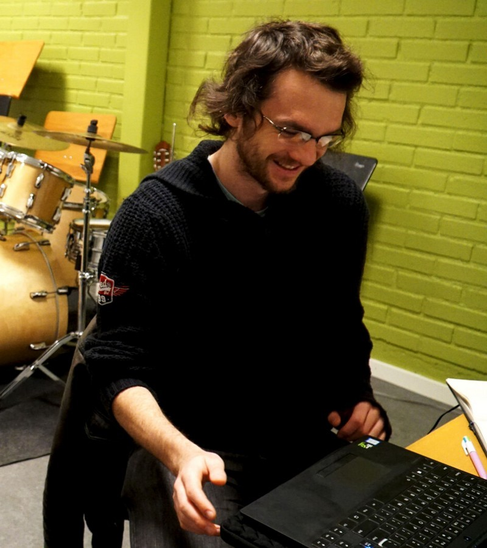

<!-- 1) HERO -->
<section id="hero" class="hero" aria-labelledby="hero-heading">
  <h1 id="hero-heading">Participant Recruitment in Accessibility Research</h1>
  

    Join us <time datetime="2025-10-20">Oct 20–26, 2025</time> for the ASSETS 2025 workshop—an interactive deep dive into best practices, challenges, and innovations in recruiting participants for accessibility studies.
  

  

    <a class="btn btn-primary" href="#participate">Submit Your Interest</a>
    

      SOI Deadline: <time datetime="2025-08-08">August 8, 2025</time>
    

  

</section>

<!-- 2) WRAP ALL OTHER SECTIONS TO BE CENTERED -->

<!-- CALL FOR PARTICIPATION -->
<section id="participate" class="section section–light" aria-labelledby="participate-heading">
  <h2 id="participate-heading" class="section-heading">Call for Participation</h2>
  
Submit your Statement of Interest by August 8, 2025

  
Opens <time datetime="2025-07-16">July 16</time> → Closes <time datetime="2025-08-08">August 8</time>. We welcome…

  <a class="btn btn-secondary" href="{{ '/participate/' | relative_url }}">Submit Your Interest</a>
</section>

<!-- SCHEDULE -->
<section id="schedule" class="section section–dark" aria-labelledby="schedule-heading">
  <h2 id="schedule-heading" class="section-heading">Schedule</h2>
  
Three interactive sessions across three days

  <ul>
    <li><strong>Day 1:</strong> Introduction and General Theme Discussion</li>
    <li><strong>Day 2:</strong> Interest-Specific Discussion</li>
    <li><strong>Day 3:</strong> Synthesis &amp; Closing</li>
  </ul>
</section>

<!-- ORGANIZERS -->
<section id="organizers" class="section section–light" aria-labelledby="organizers-heading">
  <h2 id="organizers-heading" class="section-heading">Workshop Organizers</h2>
  
Meet our team

  

    <!-- Row 1 -->
    

      
      <h3>Lloyd May</h3>
      
Ph.D. Candidate

      
Stanford University

    

        

      
      <h3>Saad Hassan</h3>
      
Faculty Member

      
Tulane University

    

        

      
      <h3>Khang Dang</h3>
      
Ph.D. Candidate

      
New Jersey Institute of Technology

    

    <!-- Row 2 -->
    

      
      <h3>Sooyeon Lee</h3>
      
Assistant Professor

      
New Jersey Institute of Technology

    

    

      
      <h3>Oliver Alonzo</h3>
      
Assistant Professor

      
DePaul University

    

  

</section>

<!-- POST-WORKSHOP -->
<section id="postworkshop" class="section section–dark" aria-labelledby="postworkshop-heading">
  <h2 id="postworkshop-heading" class="section-heading">Post-Workshop</h2>
  
Proceedings, recordings, and next steps

  
Proceedings, recordings, and collaborative white papers will be published here.

</section>