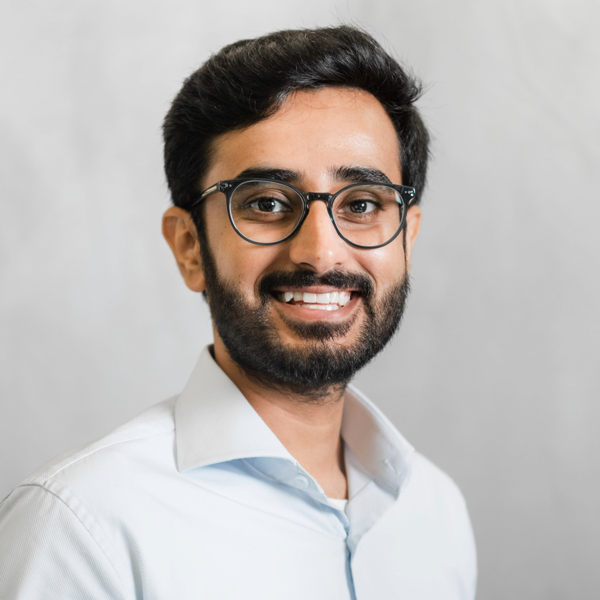

<!-- 1) HERO -->
<section id="hero" class="hero" aria-labelledby="hero-heading">
  <h1 id="hero-heading">Participant Recruitment in Accessibility Research</h1>
  

    Join us <time datetime="2025-10-20">Oct 20–26, 2025</time> for virtual sessions to discuss best practices, challenges, and innovations in recruiting participants for accessibility studies.
  

  

    <a class="btn btn-primary" href="#participate">Submit Your Interest</a>
    

      Deadline: <time datetime="2025-08-08">August 8, 2025</time>
    

  

</section>

<!-- 2) WRAP ALL OTHER SECTIONS TO BE CENTERED -->

 <!-- ABOUT -->
<section id="about" class="section section-light" aria-labelledby="about-heading">
<h2 id="about-heading" class="section-heading">About</h2>

Why this workshop matters

    Including participants with disabilities is crucial for accessibility-focused research. Recruiting from disability communities can present challenges that require careful consideration of ethical practices, intersectional representation, methodological rigor, and community sustainability. Researchers may face tensions between meaningfully including participants with disabilities and addressing concerns such as whether participants adequately represent the diversity of the community, whether certain participants may be overburdened, and how to verify and compensate participants fairly.

    This workshop will bring together members of the ASSETS community to discuss current recruiting practices and identify insights into ethical, rigorous, and inclusive participant recruitment in disability research. We will explore three main topics:

<ul class="section-list">
  <li>Recruitment methods and models</li>
  <li>Eligibility criteria and participant verification</li>
  <li>Ethical and sustainability considerations</li>
</ul>

    The workshop aims to share current practices, identify key challenges, and develop preliminary guidelines to support accessibility researchers in more sustainable participant recruitment.

</section>

<!-- CALL FOR PARTICIPATION -->
<section
  id="participate"
  class="section section-light"
  aria-labelledby="participate-heading"
>
  <h2 id="participate-heading" class="section-heading">
    Call for Participation
  </h2>
  

    Submit your Statement of Interest by <time datetime="2025-08-08">Aug 8, 2025</time>
  

  <!-- workshop-at-conference intro -->
  

    

      <strong>Our workshop is part of the ASSETS’25 conference.</strong>
      You do not have to register for the full conference to attend the workshop.
      ASSETS is an ACM conference: the Association for Computing Machinery, the
      world’s largest educational computing society.
    

    

      We also encourage you to register and attend the full ASSETS’25
      conference!
    

  

  <!-- main call content & attendee selection side by side -->
  

    <!-- left: call details -->
    

      
<em>“Nothing about us without us”</em> calls for including disability communities at every stage of computing accessibility research. Recruiting participants brings challenges around conceptualizing recruiting criteria, verification, ethics, and balancing genuine inclusion with avoiding tokenism and participant over‑burden.

      
This virtual workshop will focus on:

      <ul>
        <li>Recruitment methods & models tailored for participants with disabilities</li>
        <li>How eligibility criteria are conceptualized & verified amid tensions between various disability models</li>
        <li>Ethical considerations for sustainable engagement</li>
      </ul>
      
We will run the workshop online via Zoom across three sessions during the week of October 20–25. Participants will be selected via a Google Form where they share:

      <ul>
        <li>Their experiences recruiting for at least one computing accessibility study</li>
        <li>Perspectives related to the three workshop themes</li>
      </ul>
      
We encourage submissions from researchers at all career stages, with emphasis on diverse geographic, cultural, and smaller‑population perspectives.

      
All selected participants must register through ASSETS and actively contribute to discussions. We promise an engaging, inclusive environment to collaboratively shape best practices.

      <a class="btn btn-secondary" href="{{ '/participate/' | relative_url }}">
        Submit Your Interest
      </a>
    

    <!-- right: attendee selection -->
    

      <h3>Attendee Selection</h3>
      
We’re capping the workshop at <strong>30 participants</strong> to ensure manageable group sizes and an accessible experience online. Minimum eligibility: experience recruiting human participants in at least one disability‑ or accessibility‑related research study (others will be desk rejected).

      
If we receive more than 30 eligible applications, at least two organizers will independently rate each on a 5‑point scale (“Strongly Disagree” → “Strongly Agree”) against these questions:

      <ol>
        <li>The attendee’s prior experience aligns with the workshop themes.</li>
        <li>The attendee described what they’ll contribute to the workshop.</li>
        <li>The attendee brings a diverse perspective to our discussions.</li>
      </ol>
      
Should we need further deliberation, we’ll hold a quick synchronous meeting to finalize the attendee list.

    

  

</section>

<!-- SCHEDULE -->
<section
  id="schedule"
  class="section section-dark"
  aria-labelledby="schedule-heading"
>
  <h2 id="schedule-heading" class="section-heading">Schedule</h2>
  

    Three online sessions over the week of October 20–25, 2025
  

<!-- 1) Intro paragraph -->

We will run the workshop online via Zoom across three sessions (see <strong>Table 1</strong>) during the week of October 20–25. We will divide it into 3 online sessions spread over multiple days to reduce participant fatigue. The exact dates and times for the sessions will be determined based on selected participants' availability.

  <!-- 2) Phases grid -->
  

    

      <h3>Before the Workshop</h3>
      <ul>
        <li>
          A welcome email will include instructions on how to join the workshops’ Discord, and a poll for participants' specific topics of interest (for Session 2) and availability for different options for the 3 sessions, due <strong>September 1, 2025</strong>.
        </li>
        <li>
          We will also request that participants prepare 1-2 slides or a 1-minute video introduction by <strong>September 30, 2025</strong>, which we will share asynchronously before the workshop begins.
        </li>
      </ul>
    

    

      <h3>During the Workshop</h3>
      <ul>
        <li>
          The workshop will consist of synchronous themed group small discussions, followed by summarization of the discussion.
        </li>
        <li>
          We will post summaries of the discussions to Discord after every session to also support asynchronous discussions before sharing out.
        </li>
        <li>
          We will begin with discussions around the workshop's topics, followed by discussions centered around specific interests indicated by participants.
        </li>
      </ul>
    

    

      <h3>After the Workshop</h3>
      <ul>
        <li>
          We will maintain access to the workshop's content for asynchronous interactions.
        </li>
        <li>
          The organizers will also write a white paper summarizing the workshop's outcomes and invite interested participants to contribute.
        </li>
      </ul>
    

  

  <!-- 3) Sessions table -->
  <table class="schedule-table" aria-label="Session schedule">
    <caption> <strong>Table 1.</strong> Workshop Session Schedule</caption>
    <thead>
      <tr>
        <th>Session</th>
        <th>Duration</th>
        <th>Focus</th>
      </tr>
    </thead>
    <tbody>
      <tr>
        <td>Session 1</td>
        <td>90 min</td>
        <td>
          Welcome & introductions, followed by themed group discussions and summarization.
        </td>
      </tr>
      <tr>
        <td>Session 2</td>
        <td>90 min</td>
        <td>
          Begin with a shareout from the small groups from Session 1, including discussions on Discord. Then, interest-based group discussions and summarization.
        </td>
      </tr>
      <tr>
        <td>Session 3</td>
        <td>60 min</td>
        <td>
          Begin with a shareout from the small groups from Session 2, including discussions on Discord. Then, identify themes, concrete recommendations, and lingering questions identified throughout the workshop.
        </td>
      </tr>
    </tbody>
  </table>
</section>

<!-- ORGANIZERS -->
<section id="organizers" class="section section–light" aria-labelledby="organizers-heading">
  <h2 id="organizers-heading" class="section-heading">Workshop Organizers</h2>
  
Meet our team

  

    <!-- Row 1 -->
    

      
      <h3>Lloyd May</h3>
      
Ph.D. Candidate

      
Stanford University

    

        

      
      <h3>Saad Hassan</h3>
      
Faculty Member

      
Tulane University

    

        

      
      <h3>Khang Dang</h3>
      
Ph.D. Candidate

      
New&nbsp;Jersey&nbsp;Institute&nbsp;of&nbsp;Technology

    

    <!-- Row 2 -->
    

      
      <h3>Sooyeon Lee</h3>
      
Assistant Professor

      
New&nbsp;Jersey&nbsp;Institute&nbsp;of&nbsp;Technology

    

    

      
      <h3>Oliver Alonzo</h3>
      
Assistant Professor

      
DePaul University

    

  

</section>