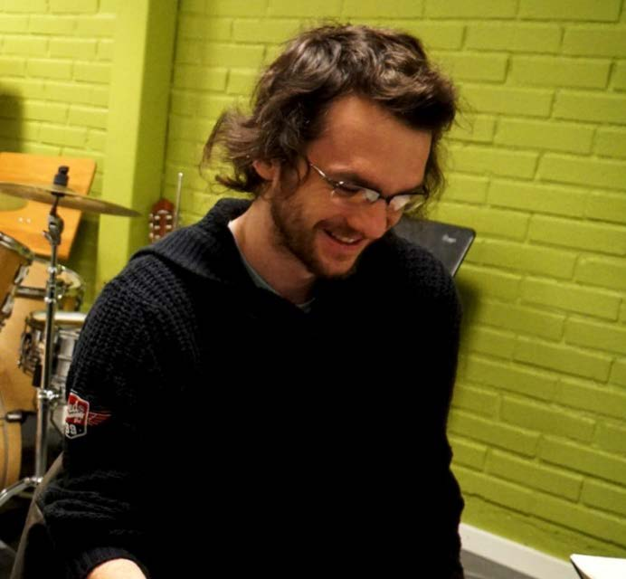

<!-- 1) HERO (with Milestones) -->
<section id="hero" class="hero" aria-labelledby="hero-heading">
  <h1 id="hero-heading">Participant Recruitment in Accessibility Research</h1>
  

    Join us during the week of October 20–26, 2025 for virtual sessions to discuss current practices, key challenges, and guidelines in recruiting participants for accessibility studies.
  

  <!-- Milestones bar -->
  

    

      ✔︎
      

        <strong>Applications closed:</strong>
        <time datetime="2025-08-22">Aug 22, 2025</time>
      

    

    

      ✔︎
      

        <strong>Welcome email sent:</strong>
        <time datetime="2025-08-25">Aug 25, 2025</time>
      

    

    

      ✔︎
      

        <strong>Early registration closed:</strong>
        <time datetime="2025-08-28">Aug 28, 2025</time>
      

    

    

      ✔︎
      

        <strong>Availability poll sent:</strong>
        <time datetime="2025-09-25">Sep 25, 2025</time>
      

    

    

      ⏳
      

        <strong>Register by 11:59 PM on:</strong>
        <time datetime="2025-10-19">Oct 19, 2025</time>
      

    

    

      📅
      

        <strong>Workshop sessions:</strong>
        <!-- wrap in <time> so our block‐rule catches it -->
        <time>Oct 21 • Oct 22 • Oct 24, 2025</time>
      

    

  

  

    <a
      class="btn btn-primary"
      href="https://web.cvent.com/event/2197df01-92d8-4c44-8ac6-4de540b0d61f/summary"
    >
      Register
    </a>
    

      Registration closes by 11:59 PM on <time datetime="2025-10-19">Oct 19, 2025</time>
    

  

</section>

 <!-- ABOUT -->
<section id="about" class="section section-light" aria-labelledby="about-heading">

<h2 id="about-heading" class="section-heading">About</h2>

    <strong>“Nothing about us without us”</strong> emphasizes the importance of including disability communities at every stage of computing accessibility research. However, recruiting participants with disabilities presents a range of challenges—including defining recruitment criteria, verifying eligibility, addressing ethical concerns, sustaining engagement, and navigating the tension between genuine inclusion and avoiding both tokenism and participant over-burdening.

    This workshop will bring together members of the ASSETS community to discuss current recruiting practices and identify insights into ethical, rigorous, and inclusive participant recruitment in disability research. We will explore three main topics:

<ul class="section-list">
  <li>Recruitment methods and models</li>
  <li>Eligibility criteria and participant verification</li>
  <li>Ethical and sustainability considerations</li>
</ul>

    The workshop aims to share current practices, identify key challenges, and develop preliminary guidelines to support accessibility researchers in more sustainable participant recruitment.

</section>

<!-- CALL FOR PARTICIPATION -->
<section id="participate" class="section section-light" aria-labelledby="participate-heading">
    

    

            <h2 id="participate-heading" class="section-heading">
            Call for Participation
            </h2>
            

            Applications closed:
            <time datetime="2025-08-08">August 22, 2025</time>
            

    

        

            Our workshop aims to address critical issues related to participant recruitment by fostering discussion around how to effectively and ethically recruit participants with disabilities for accessibility research studies. We invite participation from a diverse group of accessibility researchers to share current challenges and practices in participant recruitment and to collaboratively envision the future of inclusive recruitment. We believe this conversation will make a timely and valuable contribution to the field.
        

        

            We welcome submissions and participation from researchers across all career stages, disciplines, and geographic regions, with particular encouragement for those from the Global South, non-Western countries, and those whose work addresses the unique needs and contexts of these regions. We recognize that accessibility research has historically centered Western and Global North perspectives, and we seek to amplify a broader range of voices.
        

        

            Our workshop is part of the ASSETS’25 conference. ASSETS is an ACM conference: the Association for Computing Machinery, the world’s largest educational computing society. Attendees do not need to register for the conference to apply for the workshop.
        

        

            To apply, please complete a Google Form with a <strong>Statement of Interest (SOI)</strong> by <strong>Friday, August 22, 2025</strong>. You will be asked to briefly address the following:
        

        <ul class="section-list">
        <li>Your experience recruiting participants with disabilities—including which communities you have worked with and your considerations related to the workshop’s three core themes: recruitment methods, eligibility criteria and verification, and ethical/sustainability concerns.</li>
        <li>Why are you interested in participating in this workshop?</li>
        <li>Which workshop theme(s) are you most interested in?</li>
        <li>Any access needs you would like us to accommodate to support your participation.</li>
        </ul>
        

            Participation in the workshop is open to researchers with experience recruiting human participants in at least one disability- or accessibility-related study. Attendees will be selected based on their responses in the Statement of Interest form.
        

                

            <!-- Card: Ready to Apply (CTA) -->
            

            
✍️

            <h3>Applications closed</h3>
            

                Complete the Google Form to share your interest and your accessibility recruiting experiences.
            

            <a
                class="btn btn-primary"
                href="https://forms.gle/XrTLxiypCMxgvmiF6"
            >
                Applications closed
            </a>
            

        

        

            Please join us! Email questions to: <strong>lloydmay@stanford.edu</strong>
        

    

</section>

<!-- SCHEDULE -->
<section
  id="schedule"
  class="section section-dark"
  aria-labelledby="schedule-heading"
>

  <h2 id="schedule-heading" class="section-heading">Schedule</h2>
  

    Three online sessions during the week of October 20–26, 2025
  

<!-- 1) Intro paragraph -->

We will run the workshop online via Zoom across three sessions (see <strong>Table 1</strong>) during the week of October 20–26. We divide it into three online sessions spread over multiple days to reduce participant fatigue. The exact dates and times based on selected participants' availability are shown in Table 1.

  <!-- 2) Phases grid -->
  

    

      <h3>Before the Workshop</h3>
      <ul>
        <li>
          We will communicate by email with instructions on how to register, a link to submit your availability for the three sessions, and details on joining the workshop’s Discord.
        </li>
        <li>
          We will also ask each participant to submit a short paragraph introducing themselves.
        </li>
      </ul>
    

    

      <h3>During the Workshop</h3>
      <ul>
        <li>
          The workshop will consist of synchronous themed group small discussions, followed by summarization of the discussion.
        </li>
        <li>
          We will post summaries of the discussions to Discord after every session to also support asynchronous discussions before sharing out.
        </li>
        <li>
          We will begin with discussions around the workshop's topics, followed by discussions centered around specific interests indicated by participants.
        </li>
      </ul>
    

    

      <h3>After the Workshop</h3>
      <ul>
        <li>
          We will maintain access to the workshop's content for asynchronous interactions.
        </li>
        <li>
          The organizers will also write a white paper summarizing the workshop's outcomes and invite interested participants to contribute.
        </li>
      </ul>
    

  

  <!-- 3) Sessions table -->
  <table class="schedule-table" aria-label="Session schedule">
    <caption> <strong>Table 1.</strong> Final Workshop Session Schedule</caption>
    <thead>
      <tr>
        <th>Session</th>
        <th>Date</th>
        <th>Time (ET)</th>
        <th>Duration</th>
        <th>Focus</th>
      </tr>
    </thead>
    <tbody>
      <tr>
        <td>Session 1</td>
        <td>Oct 21, 2025</td>
        <td>3:00 PM – 4:30 PM</td>
        <td>90 min</td>
        <td>
          Welcome & introductions, followed by themed group discussions and summarization.
        </td>
      </tr>
      <tr>
        <td>Session 2</td>
        <td>Oct 22, 2025</td>
        <td>3:00 PM – 4:30 PM</td>
        <td>90 min</td>
        <td>
          Begin with a shareout from the small groups from Session 1, including discussions on Discord. Then, interest-based group discussions and summarization.
        </td>
      </tr>
      <tr>
        <td>Session 3</td>
        <td>Oct 24, 2025</td>
        <td>11:00 AM – 12:00 PM</td>
        <td>90 min</td>
        <td>
          Begin with a shareout from the small groups from Session 2, including discussions on Discord. Then, identify themes, concrete recommendations, and lingering questions identified throughout the workshop.
        </td>
      </tr>
    </tbody>
  </table>

</section>

<!-- ORGANIZERS -->
<section id="organizers" class="section section–light" aria-labelledby="organizers-heading">

  <h2 id="organizers-heading" class="section-heading">Workshop Organizers</h2>
  
Meet our team

  

    <!-- Row 1 -->
    

    
      <h3>Lloyd May</h3>
      
Ph.D. Candidate

      
Stanford University

    <ul class="social-links organizer-links" aria-label="Lloyd May's website">
        <li>
        <a
            href="https://www.lloydmay.net/"
            target="_blank"
            rel="noopener"
            aria-label="Lloyd May's website"
        >🔗</a>
        </li>
    </ul>
    

    

    
      <h3>Saad Hassan</h3>
      
Faculty Member

      
Tulane University

    <ul class="social-links organizer-links" aria-label="Saad Hassan's website">
        <li>
        <a
            href="https://saadh.info/"
            target="_blank"
            rel="noopener"
            aria-label="Saad Hassan's website"
        >🔗</a>
        </li>
    </ul>
    

    

    
      <h3>Khang Dang</h3>
      
Ph.D. Candidate

      
New&nbsp;Jersey&nbsp;Institute&nbsp;of&nbsp;Technology

    <ul class="social-links organizer-links" aria-label="Khang Dang's website">
        <li>
        <a
            href="https://www.khang4dang.net/"
            target="_blank"
            rel="noopener"
            aria-label="Khang Dang's website"
        >🔗</a>
        </li>
    </ul>
    

    <!-- Row 2 -->
    

    
    <h3>Sooyeon Lee</h3>
    
Assistant Professor

    
New&nbsp;Jersey&nbsp;Institute&nbsp;of&nbsp;Technology

    <ul class="social-links organizer-links" aria-label="Sooyeon Lee's website">
        <li>
        <a
            href="https://people.njit.edu/profile/sl287"
            target="_blank"
            rel="noopener"
            aria-label="Sooyeon Lee's website"
        >🔗</a>
        </li>
    </ul>
    

    

    
    <h3>Oliver Alonzo</h3>
    
Assistant Professor

    
DePaul University

    <ul class="social-links organizer-links" aria-label="Oliver Alonzo's website">
        <li>
        <a
            href="https://oliveralonzo.com/"
            target="_blank"
            rel="noopener"
            aria-label="Oliver Alonzo's website"
        >🔗</a>
        </li>
    </ul>
    

  
